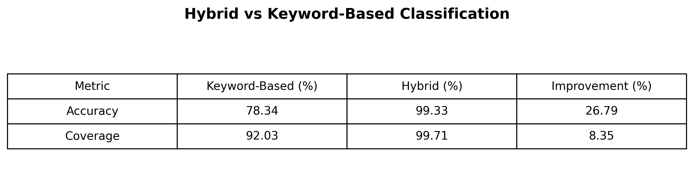
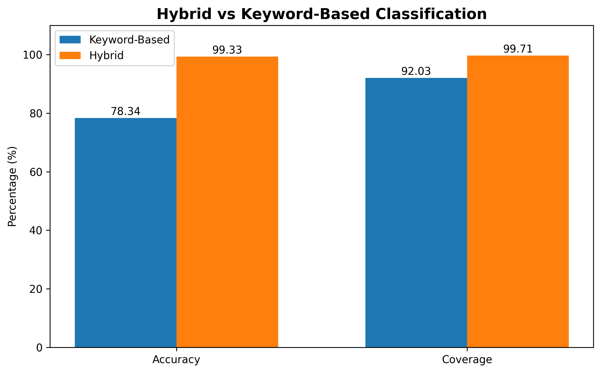

# Intelligent Log Classification System

## Overview

The Intelligent Log Classification System is a hybrid NLP-powered framework designed to automatically categorize enterprise and application logs. The system combines rule-based methods, machine learning models, and Large Language Models (LLMs) to efficiently handle logs with varying levels of complexity.

By integrating multiple classification strategies, the framework provides accurate and scalable log categorization for monitoring, debugging, and operational analysis.

---
## System Architecture


---

## Hybrid Classification Framework

The system uses a three-stage classification pipeline:

### 1. Regex-Based Classification

The first stage handles predictable and structured log patterns using predefined regular expression rules.

Examples:

* HTTP status logs
* Authentication events
* IP blocking messages
* System activity logs

### 2. Sentence Transformer + Logistic Regression

For logs that cannot be classified through regex, semantic embeddings are generated using Sentence Transformers.

These embeddings are passed to a Logistic Regression classifier trained on labeled log data.

Advantages:

* Captures contextual meaning
* Works well with sufficient training examples
* Fast inference

### 3. LLM-Based Classification

When logs are ambiguous or insufficient labeled examples exist, the system uses Large Language Models (LLMs) to determine the appropriate category.

This stage is particularly useful for:

* Legacy systems
* Rare events
* Complex workflow failures
* Deprecation notices

---

## Project Structure

```bash

Intelligent-Log-Classification-System/
│
├── models/
│   └── log_classifier.joblib
│       # Trained Logistic Regression model used for log classification.
│
├── resources/
│   ├── architecture.png
│   ├── test.csv
│   └── output.csv
│       # Contains architecture diagrams, sample input logs, and generated classification results.
│
├── training/
│   ├── dataset/
│   │   └── synthetic_logs.csv
│   │       # Synthetic enterprise log dataset used for model training and evaluation.
│   │
│   └── log_classification.ipynb
│       # Jupyter notebook for data preprocessing, embedding generation,
│       # model training, and performance evaluation.
│
├── classify.py
│   # Main classification pipeline that routes logs through
│   # Regex, ML, and LLM-based classifiers.
│
├── processor_regex.py
│   # Rule-based classifier using Regular Expressions
│   # for structured and predictable log patterns.
│
├── processor_bert.py
│   # Semantic classification module using Sentence Transformers
│   # and Logistic Regression for supervised prediction.
│
├── processor_llm.py
│   # LLM-powered classifier for handling complex,
│   # ambiguous, and previously unseen log messages.
│
├── server.py
│   # FastAPI application providing REST APIs
│   # for batch log classification.
│
├── requirements.txt
│   # List of Python dependencies required to run the project.
│
├── .gitignore
├── LICENSE
└── README.md

```
   
---

## Technologies Used

### Backend

* FastAPI
* Uvicorn

### Machine Learning

* Scikit-Learn
* Logistic Regression

### Clustering & Pattern Discovery	

* DBSCAN
  
### Embedding Models	

* all-MiniLM-L6-v2
  
### NLP

* Sentence Transformers
* Regular Expressions
* BERT

### LLM

* Groq API
* Llama Models(Llama 3.3 70B Versatile)

### Data Processing

* Pandas
* NumPy
  
### API Testing

* Postman

---

## Installation

### Clone Repository

```bash
git clone https://github.com/Desilva93/Intelligent-Log-Classification-System.git
```

### Install Dependencies

```bash
pip install -r requirements.txt
```

### Configure Environment Variables

Create a `.env` file and add:

```text
GROQ_API_KEY=your_api_key_here
```

---

## Running the Application

Start the FastAPI server:

```bash
uvicorn server:app --reload
```

Server URLs:

```text
http://127.0.0.1:8000
```

---

## Input Format

The system accepts a CSV file uploaded through the FastAPI endpoint. The input file must contain the following columns:

| Column      | Description                                                  |
| ----------- | ------------------------------------------------------------ |
| source      | Name of the application or system generating the log message |
| log_message | Raw log text that needs to be classified                     |

### Example Input

```csv
source,log_message
ModernCRM,IP 192.168.133.114 blocked due to potential attack
BillingSystem,User 12345 logged in.
LegacyCRM,Case escalation for ticket ID 7324 failed because the assigned support agent is no longer active.
```

The uploaded CSV is processed row by row, and each log message is passed through the hybrid classification pipeline.

---

## Output Format

After classification, the system generates a new CSV file containing all original columns along with an additional column:

| Column       | Description                                                 |
| ------------ | ----------------------------------------------------------- |
| source       | Original log source                                         |
| log_message  | Original log message                                        |
| target_label | Predicted category assigned by the classification framework |

### Example Output

```csv
source,log_message,target_label
ModernCRM,IP 192.168.133.114 blocked due to potential attack,Security Alert
BillingSystem,User 12345 logged in.,User Action
LegacyCRM,Case escalation for ticket ID 7324 failed because the assigned support agent is no longer active.,Workflow Error
```

The classified results are saved as:

```text
resources/output.csv
```

and returned to the user through the FastAPI API for download.

## Evaluation

The proposed Hybrid Classification Framework was evaluated against a Keyword-Based Classification baseline using the synthetic enterprise log dataset.

### Results

| Metric   | Keyword-Based | Hybrid Framework |
| -------- | ------------- | ---------------- |
| Accuracy | 78.34%        | 99.29%           |
| Coverage | 92.03%        | 99.71%           |

### Key Observations

* Improved classification accuracy by **26.74%** over the keyword-based approach.
* Increased log coverage from **92.03%** to **99.71%**, reducing unclassified logs.
* Effectively handled semantically similar, unseen, and complex log messages through the combination of Regex, Sentence Transformers, Logistic Regression, and LLM-based classification.

### Evaluation Visualizations

#### Performance Comparison Table



#### Performance Comparison Chart



